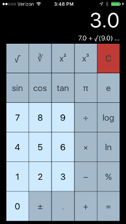
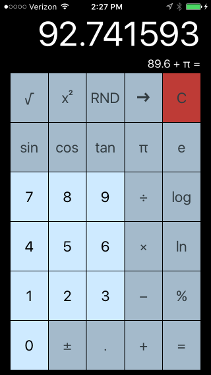

---
# Use default settings for the project website.
---

# Overview

This is the calculator project from Paul Hegarty's Stanford CS193p Winter 2017 course _"Developing iOS 10 Apps with Swift."_

## Unit Testing

Unit testing isn't covered in the on-line course which is, IMHO, a shame really because I believe good unit testing is an important component to any project. Not only does it help simplify development testing but it also quickly validates changes made to a project. I added unit tests for both the calculator back-end model and the user interface. The model and UI unit tests are in CalculatorTests and CalculatorUITests, respectively.

# Assignment I

The basic assignment was pretty straightforward. A trap that I find easy to fall into with an assignment such as this one is when re-creating the code that Paul creates in the class is re-creating the code without taking time to understand the architecture Paul has created for the app. Paul has created this calculator app multiple times for this class and makes it look easy. But there is a well thought out design behind this implementation. Taking time to understand his design for the calculator brain and the accumulator is important.

That said, one piece of this assignment that I spent a fair amount of time considering was implementing the input sequence description. Hint 4 states "Economy is valuable in coding." There is another hint that suggests using a tuple for the accumulator and the input sequence associated with the accumulator value. I like the idea of coupling related data but a simple tuple doesn't quite jive with my thinking. It's too simple a data structure for what I think the accumulator and the input sequence need to do. I made the code work with a tuple for the accumulator and associated description of the input sequence but I'm not a fan of how it's implemented. Basically, I don't like the special case needed to handle unary operations when there is a pending operation. To make this work properly I needed to consume the description from the pending operation to prepend to the description before the unary opertation description and set the pending operation description to an empty string. This all works as required but I think a structure for the accumulator that has the current accumulator value, the input sequence and other properties and methods specific to handling the accumulator would work better. That said, this could be my naiveté with Swift or the design of the calculator brain. Regardless, I made the code work within the guidelines as I understood them and commented the code to clarify the unary description case.

The code for Assignment I is on GitHub: [CS193p Calculator - Assignment I](https://github.com/mjordan56/cs193p-calculator/tree/v1.0)

## Unit Tests

There are a set of unit tests for validating the functionality of the calculator brain. These tests are all pretty straightforward but they were really nice to have while implementing and verifying the behavior of the model; especially the input sequence description.

## UI Unit Tests

There are also a set of UI unit tests to validate the behavior of the calculator in accordance with the "specifications" identified in the assignment. Again, these tests are all pretty straightforward and were really nice to have while implementing and verifying the behavior of the display and input sequence description text.

## Optional "Extra Credit" Features

The code for the extra credit tasks for Assignment I is on GitHub under a separate v1.1 release tag: [CS193p Calculator - Assignment I](https://github.com/mjordan56/cs193p-calculator/tree/v1.1)

As the assignment says, "these are all pretty easy..." They were, indeed, pretty easy and straightforward to implement. I updated the model and UI tests to cover the new functionality and behaviors introduced by these feature enhancements. To accommodate the new backspace and random number buttons on the calculator I just repurposed the cubed and cubed root buttons instead of spending a lot of time on designing a new layout for the calculator.

### Observation On NumberFormatter

I was really impressed with the power and flexibility of the iOS struct NumberFormatter. This struct supports a __wide__ variety of number formatting needs including localizing for different locales. For this extra credit task just a few of the number formatting features were needed but I can see how this struct can be a powerful tool for formatting numbers.
